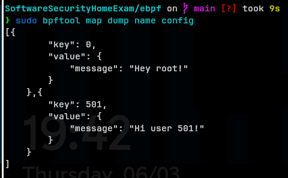
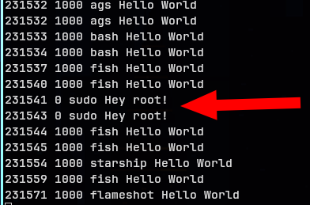
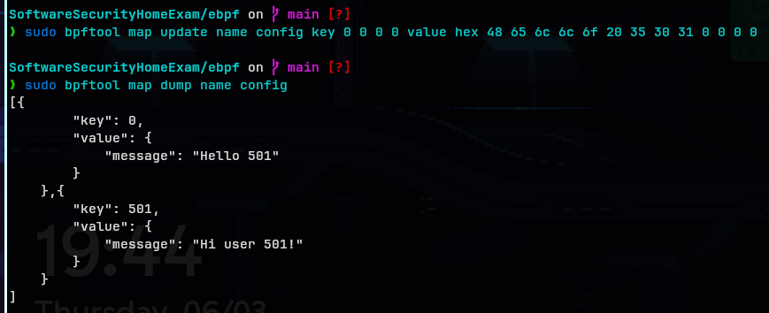
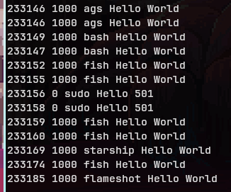

# eBPF

> [!NOTE]
> make sure you are in the correct directory
>
> in order to be able to run the first command from below

for this one we will need 2 seprate terminal windows

in the first terminal we will run the following

```bash

sudo ./hello-buffer-config.py

```

let it run while we will make changes in the second terminal window

run the following to check how the default config map looks like

```bash

sudo bpftool map dump name config

```



we can verify this by looking at the output from the first command



modify the config map through the terminal

```bash

sudo bpftool map update name config key 0 0 0 0 value hex 48 65 6c 6c 6f 20 35 30 31 0 0 0 0

```



again, we can verify this by looking at the output from the first command



let's break down this long and complicated command

```bash

[sudo bpftool map update name config] [key 0x0 0 0 0] [value hex 48 65 6c 6c 6f 20 35 30 31 0 0 0 0]
 < the command that was requested >  < key in the map > < the value of the message in hex ascii >

 48 = H
 65 = e
 6c = l
 6c = l
 6f = o
 20 = space
 35 = 5
 30 = 0
 31 = 1

 the rest of the zeros are for padding

```
