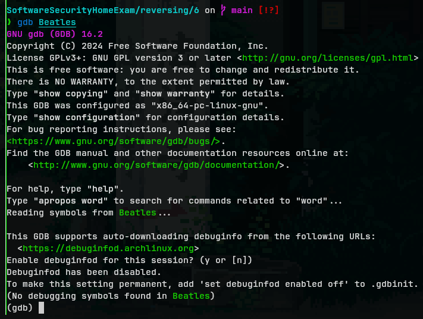
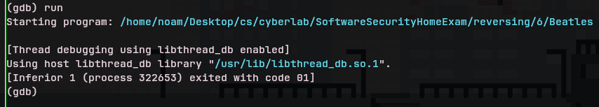
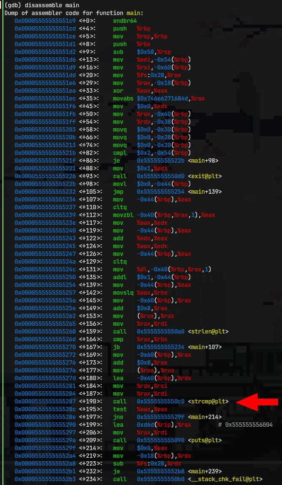
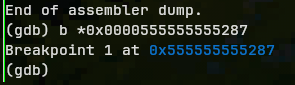
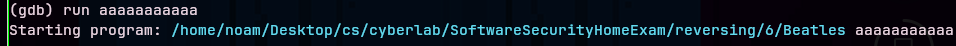
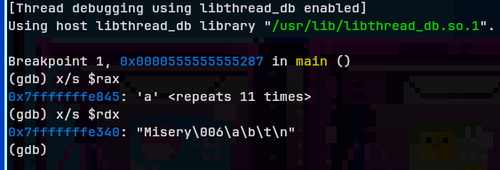
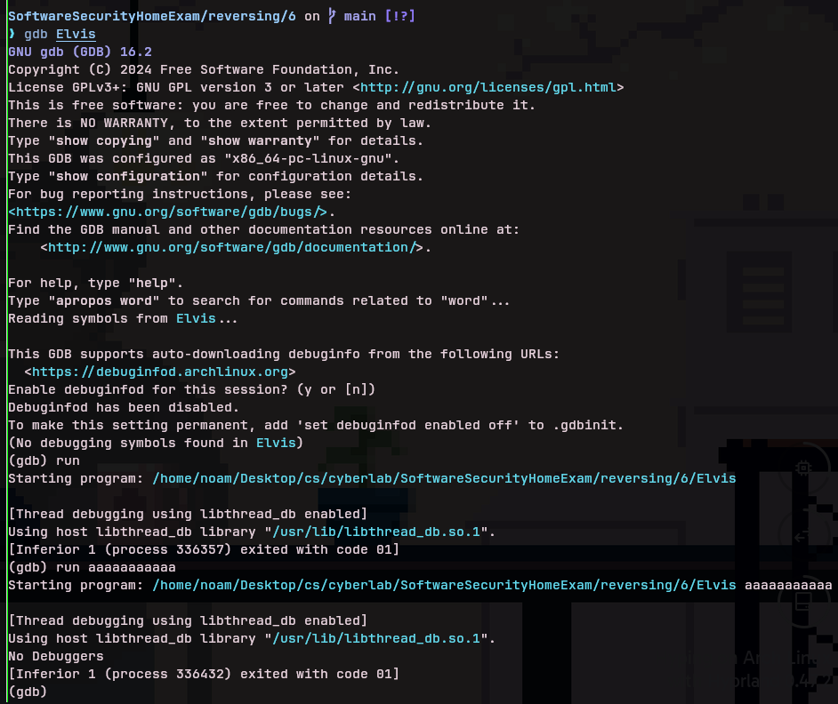
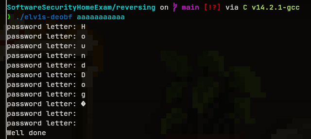
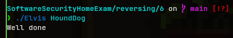
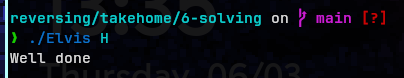

# reversing

- [x] Beatles - medium (debugger - gdb)
- [x] Elvis - hard (disassembler - decomplier - ghidra)
- [x] Madonna - easy (plain text)

# solving Madonna

in the terminal run:

```bash

strings Madonna

```

we will get this output


and we can see that there is one string that feels out of place

so when we try to run it

```bash

./Madonna RayOfLight

```

we get this


the password is `RayOfLight`

solved!

# solving Beatles

when you try to run `strings` in the terminal on the Beatles elf binary you will see nothing suspicios

so next thing to try is using a debugger (`gdb`)

```bash

gdb Beatles

```



inside of the `gdb` console

run the program once without any arguments, so that we can put a breakpoint onto it later

```bash

run

```



disassemble the main function

```bash

disassemble main

```



we need to take the address of the `strcmp` function so that we can put a breakpoint there

in this case

```bash

b *0x0000555555555287

```



now we will run it with an arbitrary argument (the letter a repeating 11 times)

```bash

run aaaaaaaaaaa

```





now that the program has stopped at the breakpoint we set before, we are able to see the contents of the registers

and as we can see one of them is the argument we provided so that means the second one must be the password

let's check


the password is `Misery`

solved!

# solving Elvis

running `strings` will not show anything

trying to connect will debugger will not work



next thing to try is deocmpiling

- open ghidra
- create new project (CTRL + N) or (File > New Project...)
- name the project
- import the Beatles elf binary (I) or (File > Import File...)
- double-click on it to open it using the tool `CodeBrowser`
in the window that has opened, on the left side, from the 3 vertical boxes, in the one labeled `Symbol tree`
- double-click on Functions > main
this will open the decopiled view of the main function in the window on the right

now we will select all the decomplied code and will paste it into a `.c` file for further examination

[decompiled](Elvis-decompiled.c)

after deobfuscating you get this

[deobfuscated](Elvis-deobfuscated.c)

after adding the relevant line and nuking the line that exits the program we can compile and run it with an arbitrary argument

compile with the below command

```bash

gcc Elvis-deobfuscated.c -o elvis-deobf

```

then run it with the below command

```bash

./elvis-deobf aaaaaaaaaaa

```



the password seems to be `HoundDog`, let's check

```bash

./Elvis HoundDog

```



the password is `HoundDog`

solved!

> [!NOTE]
> from further experiments it seems that when provided with any substring of the password `HoundDog` the Elvis elf will print `Well done`


