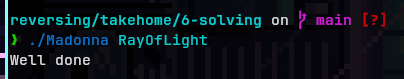

# reversing

- [x] Beatles - medium (could be done using debugger - gdb)
- [x] Elvis - hard
- [x] Madonna - easy (plain text)

# solving Madonna

in the terminal run:

```bash

strings Madonna

```

we will get this output


and we can see that there is one string that feels out of place

so when we try to run it

```bash

./Madonna RayOfLight

```

we get this



the password is `RayOfLight`

solved!

# solving Beatles

when you try to run `strings` in the terminal on the Beatles elf binary you will see nothing suspicios

so next thing to try is deocmpiling

- open ghidra
- create new project (CTRL + N) or (File > New Project...)
- name the project
- import the Beatles elf binary (I) or (File > Import File...)
- double-click on it to open it using the tool `CodeBrowser`
in the window that has opened, on the left side, from the 3 vertical boxes, in the one labeled `Symbol tree`
- double-click on Functions > main
this will open the decopiled view of the main function in the window on the right

now we will select all the decomplied code and will paste it into a `.c` file for further examination

[decompiled](Beatles-decompiled.c)

after deobfuscating you get this

[deobfuscated](Beatles-deobfuscated.c)

after adding the relevant line it will print the answer (it is piossible to run `.c` file onlie using [onlinegdb](https://www.onlinegdb.com/))


the password is `Misery`

solved! - in retrospect, using a debugger for this one might be easier but i dont fully remember how to, so i pulled out the big guns

# solving Elvis

the first steps are the same as with the Beatles

then we have

[decompiled](Elvis-decompiled.c)

after deobfuscating you get this

[deobfuscated](Elvis-deobfuscated.c)

fuck this shit! long story short, the password is `H` idk why.
